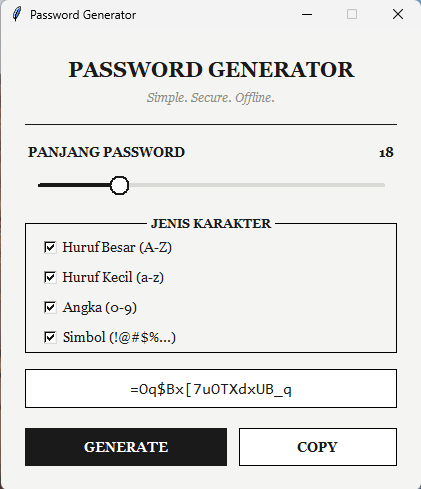

# Password Generator

Aplikasi desktop sederhana untuk membuat random password, dibuat dengan Python + Tkinter. Tidak butuh koneksi internet maupun database — semua proses generate password terjadi secara lokal di komputer kamu.

 

## Fitur

- Atur panjang password (4–64 karakter) lewat slider
- Pilih jenis karakter: huruf besar, huruf kecil, angka, simbol
- Generate password secara acak dan aman (`secrets` module)
- Copy password ke clipboard dengan satu klik
- Tampilan monokrom klasik, ringan, tanpa dependensi eksternal saat dijalankan

## Screenshot



## Cara Menjalankan dari Source

Pastikan Python 3 sudah terpasang, lalu jalankan:

```bash
python password_generator.py
```

## Struktur Proyek

```
├── password_generator.py   # source code aplikasi
├── icon.ico                # icon aplikasi
└── README.md
```

## Lisensi

Bebas digunakan dan dimodifikasi untuk keperluan pribadi.